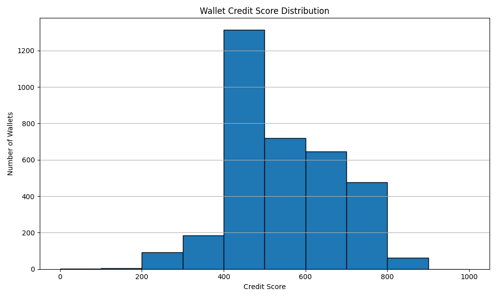

# Credit Scoring Analysis

## 1. Score Distribution

The credit scores for wallets are distributed in the range of 0 to 1000, with most scores clustering in the mid to upper range. The distribution is as follows:
-- -- -- -- -- -- -- -- -- -- -- --- -- -- -- --
| Score Range | Number of Wallets | Percentage |
|-------------|------------------|------------|
| 0-100       | 2                | 0.1%       |
| 100-200     | 4                | 0.1%       |
| 200-300     | 92               | 2.6%       |
| 300-400     | 184              | 5.3%       |
| 400-500     | 1313             | 37.5%      |
| 500-600     | 719              | 20.6%      |
| 600-700     | 646              | 18.5%      |
| 700-800     | 476              | 13.6%      |
| 800-900     | 61               | 1.7%       |
| 900-1000    | 0                | 0.0%       |
-- -- -- -- -- -- -- -- -- -- -- --- -- -- -- --

---

## 2. Behavior of Wallets by Score Range

### Low Score Wallets (Score < 300)
- **Typical behaviors:**
  - Very few transactions, often only 1-2.
  - Low or negligible USD volume.
  - High risk indicators (e.g., bot-like activity, only liquidation calls, erratic transaction sizes).
  - Poor or no repayment behavior, or borrowing without deposits.
  - Little to no asset diversification.
- **Interpretation:**  
  These wallets are likely bots, exploit attempts, or users with risky or incomplete engagement with the protocol.

### High Score Wallets (Score ≥ 700)
- **Typical behaviors:**
  - High number of transactions and long activity duration.
  - High total USD volume and consistent transaction sizes.
  - Good diversification across multiple assets.
  - Healthy ratios of deposit, borrow, and repay actions.
  - Low risk indicators, high consistency, and strong repayment behavior.
- **Interpretation:**  
  These wallets represent responsible, active users who interact with the protocol in a healthy, diversified, and consistent manner.

---

## 3. Statistical Summary

- **Mean Score:** 536.59
- **Median Score:** 520.87
- **Standard Deviation:** 135.85
- **Min Score:** 0.00
- **Max Score:** 871.15

---

## 4. Insights

- The majority of wallets fall in the [400-800] range, indicating moderate to good behavior.
- A small percentage of wallets have extremely low scores, often due to inactivity, high risk, or exploitative patterns.
- High scoring wallets tend to have diversified activity, regular usage, and good financial health indicators (repayment, leverage, etc.).
- The scoring model is robust to outliers and penalizes risky or bot-like behavior.

---

## 5. Limitations & Assumptions

- The model is based solely on on-chain transaction data; off-chain creditworthiness is not considered.
- Some wallets may be new or have limited history, which can affect their score.
- The scoring logic is transparent and extensible, but further improvements could include more advanced anomaly detection or time-series analysis.

---

## 6. Score Distribution Graph




## 7. Terminal Output

Below is a sample output from running the scoring system:

```
Loading transaction data...
Preprocessing data...
Engineering features...
Calculating credit scores...

Processed 3497 wallets

Top 5 Highest Scoring Wallets:
                                          wallet  ...  total_usd_volume
2481  0x044c53d8576d4d700e6327c954f88388ee03b8db  ...     321226.242745
727   0x012f15e260f6275bc8e62be475adb07549765e70  ...      16215.715490
2547  0x046a5d95317dbc2ae8ed4a0c370b9183d161a14a  ...      12426.085622
42    0x000c8e2871750f458bf1de8ab528dda09bc95db6  ...      15694.711530
2181  0x03af63559532b015e76b2e70f6940304be09784f  ...      20220.574758

[5 rows x 4 columns]

Top 5 Lowest Scoring Wallets:
                                          wallet  ...  total_usd_volume
2800  0x04dde662ee487ca57b13932a23352eb854ec36bf  ...          0.000108
159   0x003be39433bde975b12411fbc3025d49d813a84f  ...          0.732132
1412  0x0258fefede90decf71000c32412f33726b27d5c0  ...          1.758562
3433  0x05f78c7f3e79c3a6c453d188b013e3812e52cabb  ...          1.094377
1548  0x02948cbed87c7ac0beb2488396a3886b9f656634  ...          0.062782

[5 rows x 4 columns]

=== CREDIT SCORING ANALYSIS ===

Score Distribution Statistics:
Mean Score: 536.59
Median Score: 520.87
Standard Deviation: 135.85
Min Score: 0.00
Max Score: 871.15

Score Range Distribution:
0-100: 2 wallets (0.1%)
100-200: 4 wallets (0.1%)
200-300: 92 wallets (2.6%)
300-400: 184 wallets (5.3%)
400-500: 1313 wallets (37.5%)
500-600: 719 wallets (20.6%)
600-700: 646 wallets (18.5%)
700-800: 476 wallets (13.6%)
800-900: 61 wallets (1.7%)
900-1000: 0 wallets (0.0%)

Low Score Wallets Analysis (Score < 300): 98 wallets
Average transactions: 3.07
Average USD volume: $134541.37
Average risk indicators: 0.009

High Score Wallets Analysis (Score >= 700): 537 wallets
Average transactions: 76.64
Average USD volume: $1642989.10
Average consistency: 0.134

Results saved to 'wallet_credit_scores.csv'
``` 
 
